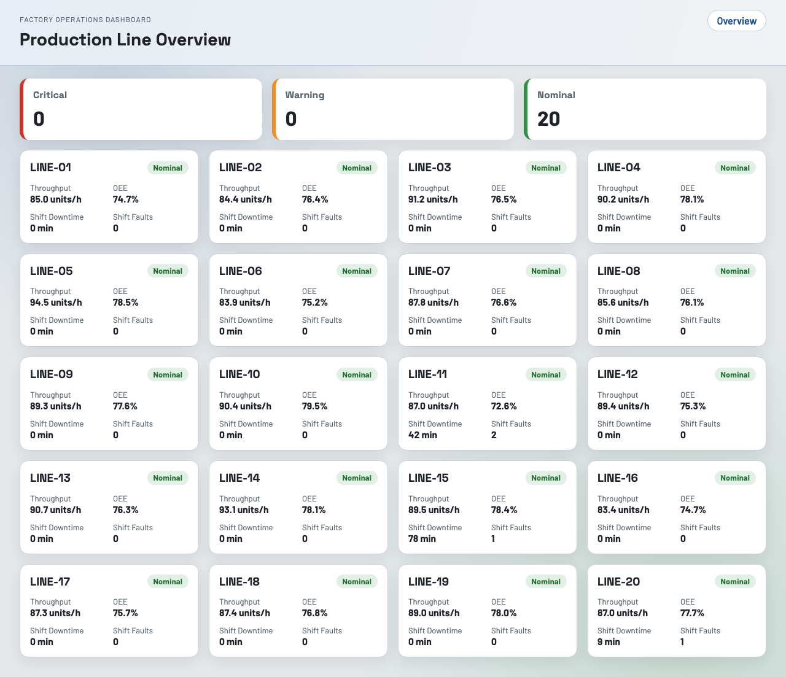
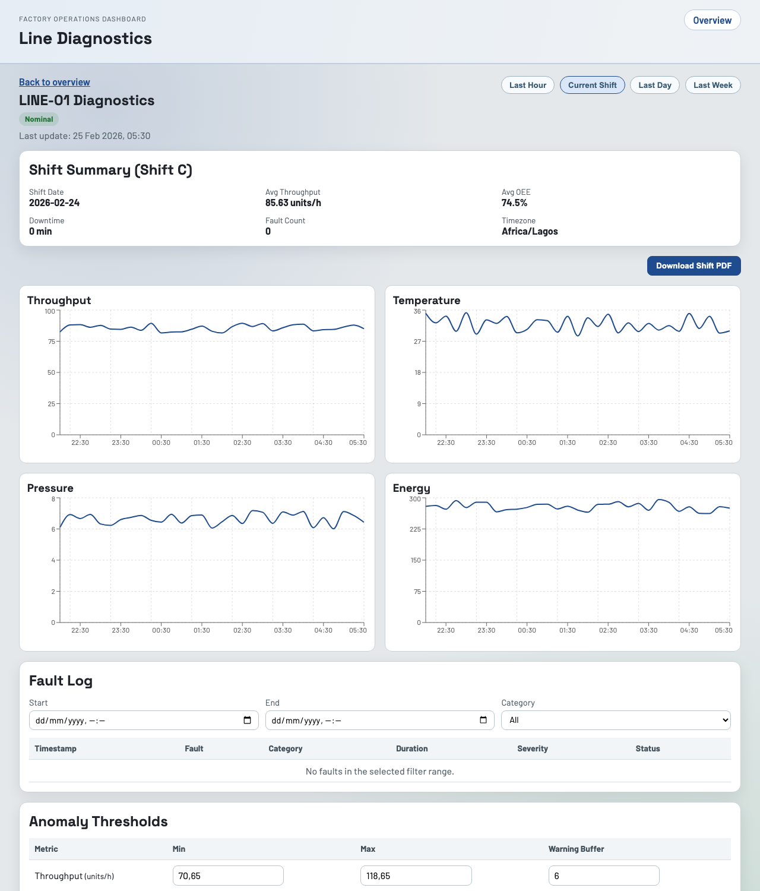
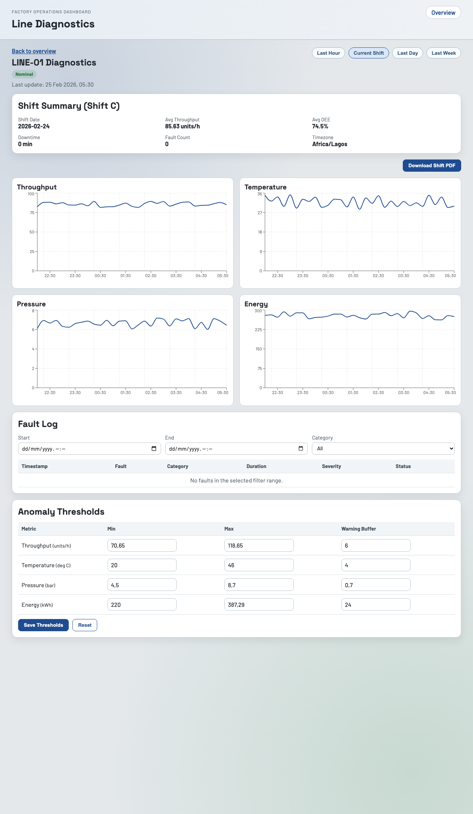
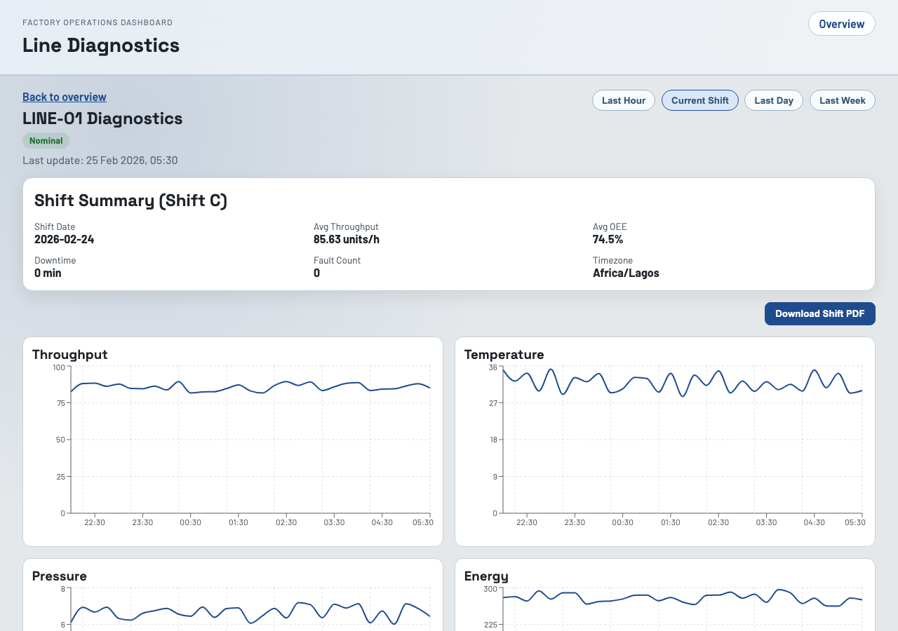

# Energy Analytics Dashboard

A portfolio-grade industrial operations dashboard built with React and Express to visualize production line telemetry from synthetic SCADA-like exports.

## Live Demo

- Frontend (Vercel): `TBD after deploy`
- API (Render): `TBD after deploy`
- API health check: `TBD after deploy` + `/api/health`

After deploying, replace the values above with your production URLs.

## Screenshots







## Highlights

- 20-line production overview with severity-first sorting (critical/warning first)
- Line diagnostics view with time-series charts for throughput, temperature, pressure, and energy
- Anomaly markers and tooltip explanations based on configurable thresholds
- Fault log with severity colors and filters
- On-demand shift handover PDF generation
- Synthetic data generator and CSV exporter for realistic demo datasets

## Stack

- Frontend: React 19, TypeScript, Vite, React Query, Recharts
- Backend: Node.js, Express, TypeScript, Zod
- Shared: Type-safe contracts and utility logic in `packages/shared`
- Data: Synthetic generator with PostgreSQL Prisma schema scaffold
- CI/CD: GitHub Actions, Vercel (web), Render (API + Postgres)

## Monorepo Structure

- `apps/web` - React dashboard
- `apps/api` - Express API + synthetic data services
- `packages/shared` - shared types/constants/utilities
- `docs` - PRD, architecture, deployment notes

## Local Setup

```bash
npm install
cp apps/api/.env.example apps/api/.env
cp apps/web/.env.example apps/web/.env
npm run dev
```

- Web: `http://localhost:5173`
- API: `http://localhost:4000`

## Useful Commands

```bash
npm run lint
npm run typecheck
npm run test
npm run build
npm run generate:data -w @energy-dashboard/api
npm run generate:csv -w @energy-dashboard/api
```

## Shift Model

Timezone: `Africa/Lagos`

- Shift A: 06:00 to 13:59
- Shift B: 14:00 to 21:59
- Shift C: 22:00 to 05:59

## Deployment Targets

- Frontend: Vercel
- API + PostgreSQL: Render

Detailed instructions:

- `docs/deployment.md`
- `docs/release-checklist.md`

## Data Note

This project intentionally uses synthetic data only. No real factory or proprietary SCADA data is included.
